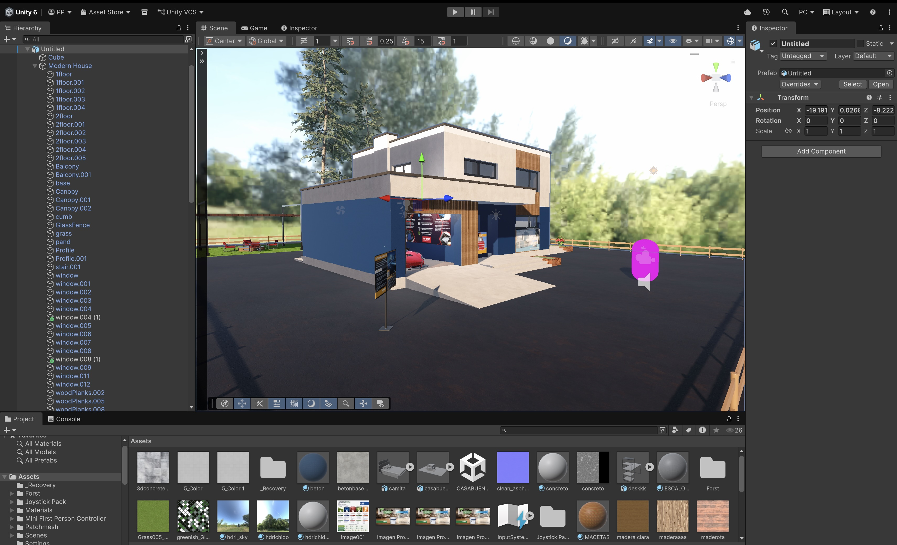
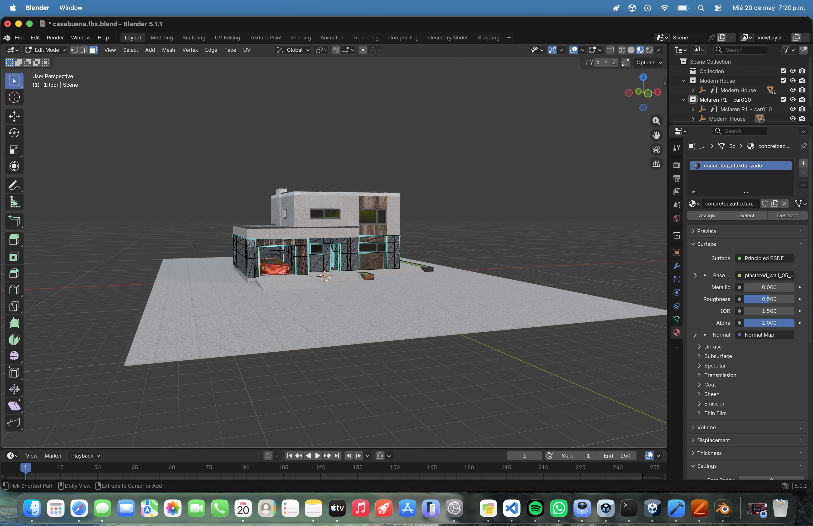
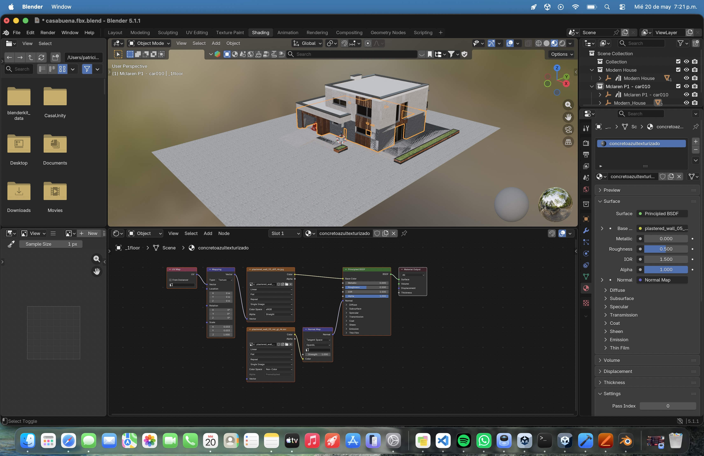
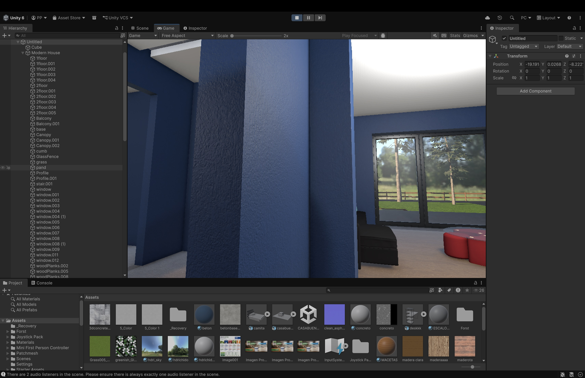

# VR Interactive Demo

Interactive VR/WebGL prototype focused on QA workflows,
environment setup, and user interaction testing.

---

## Screenshots

### Environment

### Interior

### Blender Modeling

### Shader / Map Testing

### Texture Work

---

## Features

- Interactive VR environment
- WebGL deployment
- QA interaction testing
- Environment exploration
- Basic shader experimentation
- Unity scene setup

---

## Tech Stack

- Unity
- C#
- Blender
- WebGL
- GitHub

---

## Status

Prototype / Learning Project
---

## Playable Demo

(https://play.unity.com/en/games/70105386-b1cb-483b-8f1a-2a2d89854d5d/unityplaybuild)

---

## WebGL Deployment Process

This project was exported from Unity using WebGL build settings and deployed online for browser-based testing.

### Deployment Steps

1. Configure Unity WebGL Publishing Settings
   - Compression Format: Brotli/Gzip
   - Decompression Fallback: Enabled

2. Generate a WebGL build using Unity

3. Prepare browser-compatible deployment files

4. Upload and publish the project using Unity Play

5. Validate browser loading and interaction behavior

---

## QA Focus Areas

- Browser compatibility testing
- Environment interaction validation
- Scene loading behavior
- WebGL deployment workflow
- Performance observation)

---

## WebGL Deployment Process

This project was exported from Unity using WebGL build settings and deployed online for browser-based testing.

### Deployment Steps

1. Configure Unity WebGL Publishing Settings
   - Compression Format: Brotli/Gzip
   - Decompression Fallback: Enabled

2. Generate a WebGL build using Unity

3. Prepare browser-compatible deployment files

4. Upload and publish the project using Unity Play

5. Validate browser loading and interaction behavior

---

## QA Focus Areas

- Browser compatibility testing
- Environment interaction validation
- Scene loading behavior
- WebGL deployment workflow
- Performance observation
